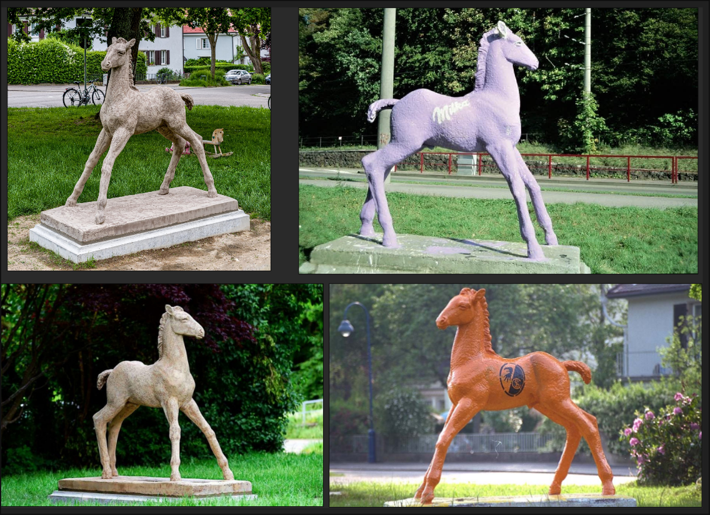
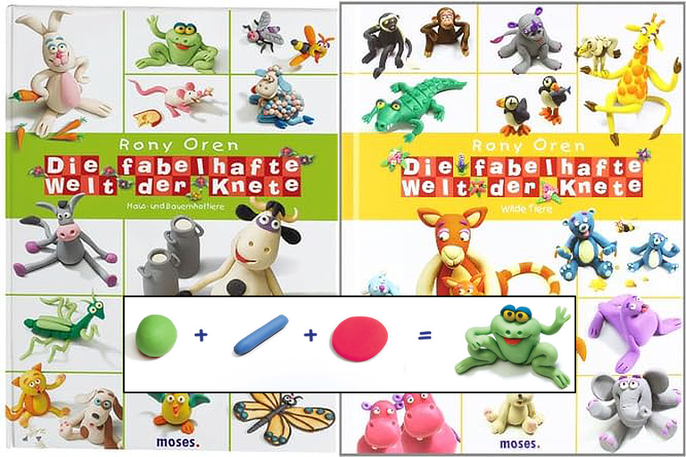
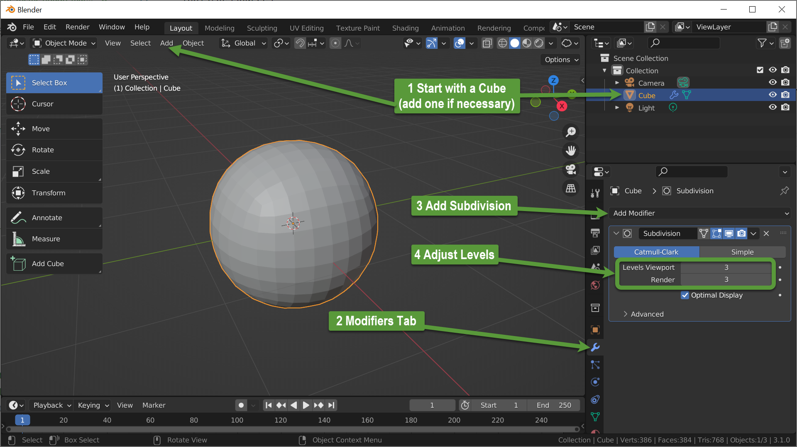
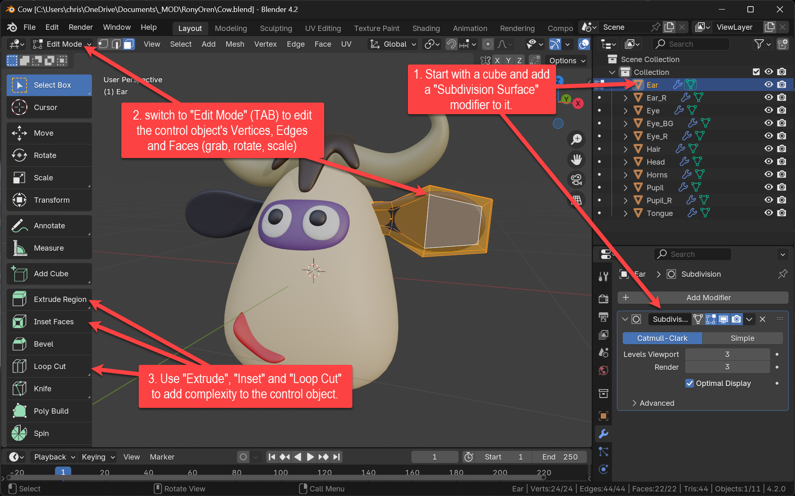
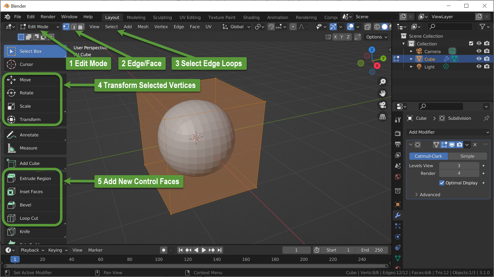
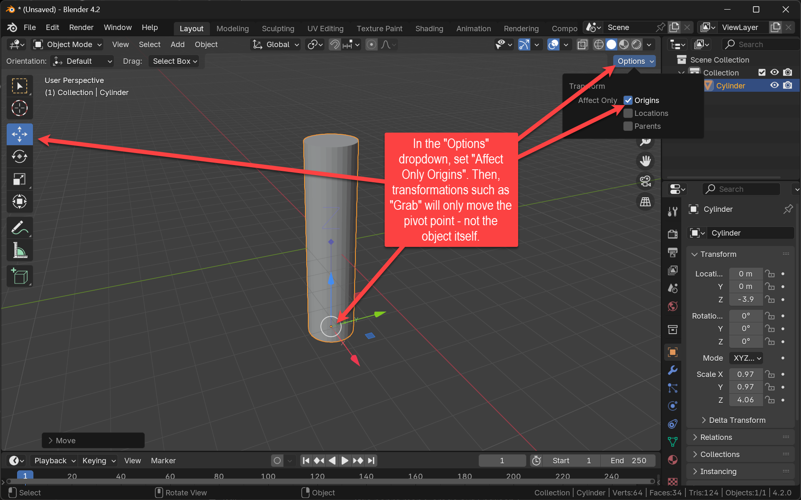
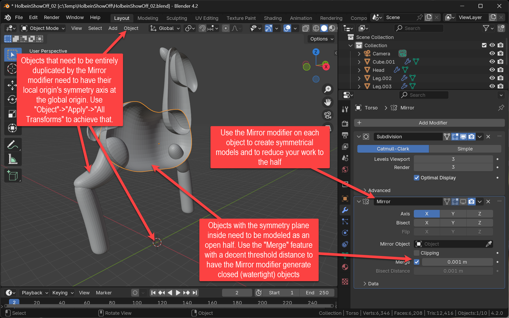
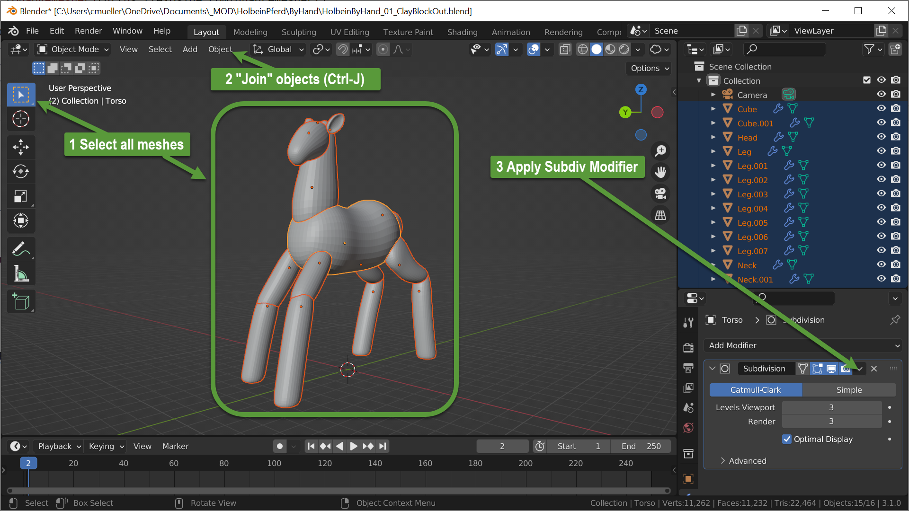
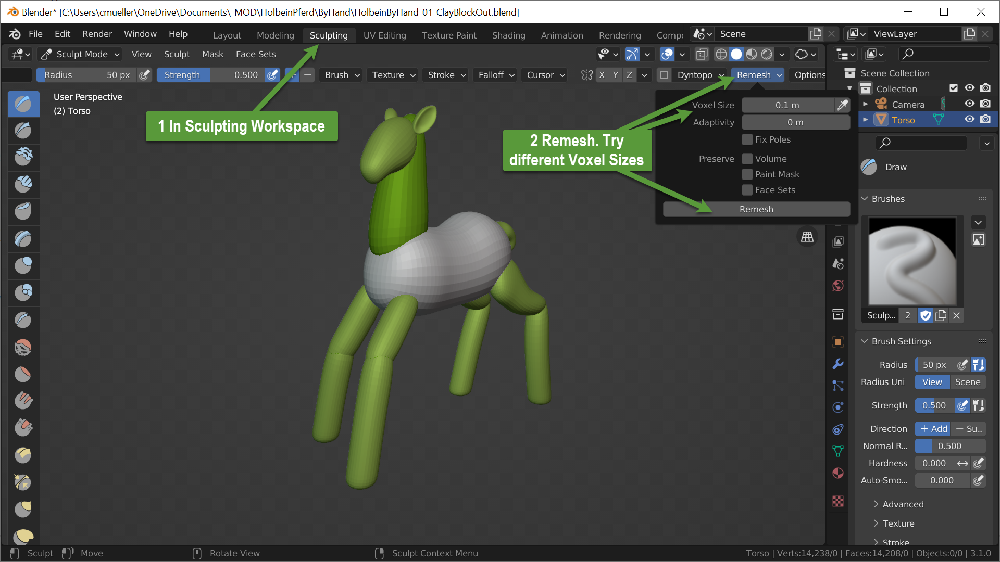
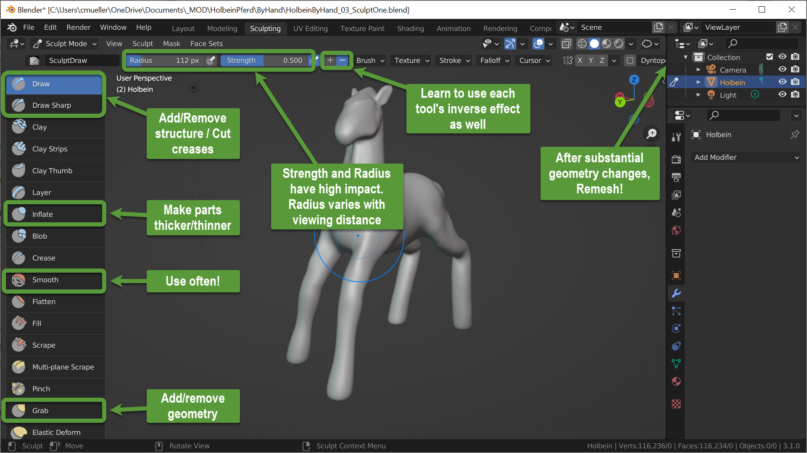

+++
title = 'Guerilla Guide to Modeling I'
draft = false
weight = 30 
+++

Dieses Kapitel zeigt einen Workflow in der 3D-Software [Blender](https://www.blender.org/download/) zur Erstellung von 3D-Modellen, die durch reale Objekte inspiriert sind.

Der Workflow durchläuft die folgenden Stufen:

Der Vorteil dieses Workflows ist, dass bis zum Schritt 3 (Retopology), nur die Form des Modells eine Rolle spielt. Hier muss noch kein Augenmerk auf die Realisierung als funktionierendes Modell in einer Game-Engine gelegt werden. Erst in späteren Schritte 

## 1. Referenz-Material sammeln und organisieren

Vor dem Modeling ist es hilfreich, Referenz-Bilder zu sammeln. Hier muss es nicht darum gehen, exakte Abbildungen des späteren Modells zu erstellen. Oft genügt auch eine Sammlung von Bildern, die als Inspiration dienen. Zur Organisation von Bildmaterial, das bei der Modellierung als Referenz dient, eignet sich die kostenlose Software [PureRef](https://www.pureref.com/download.php). In dieser können Ansichten, Inspirationsbilder etc. für das zu erstellende Modell gesammelt werden, so dass diese bei der Modellierung immer zur Verfügung stehen.

## 2. 3D-Objekt aus Grundobjekten ausgestalten

Inspiration: Die [Rony Oren Knet-Methode](https://ronysclayground.com/): Alles ist ein Ball, ein Hot-Dog oder ein Pfannekuchen. Ganz so sklavisch muss es nicht gesehen werden, **aber**: 

> **Aus einfachen, zunächst einfach knetbaren 3D-Objekten lässt sich ein Grundgerüst für jedes beliebige 3D-Modell erstellen.**

Beim Arrangieren der Knet-Klumpen helfen die Referenzbilder. Dabei können in Blender immer wieder Beobachtungspositionen wie in den Referenzbildern eingenommen werden und die Form und das Arrangement der Knetklumpen verfeinert werden. Wenn es orthografische Seitenansichten gibt, können diese [direkt in Blender als Hintergrundbilder](https://www.youtube.com/watch?v=lpIonmH90-k) verwendet werden. 

### Einzelne Knetklumpen erstellen

Jeder Knetklumpen entsteht dabei aus einem Würfel, der mit Hilfe des Subdivision-Modifiers zu einem rundlichen Objekt wird:

Wie füge ich einen Subdivision Modifier ein?: Im Properties-Editor auf den "Modifiers" Tab (Gabelschlüssel-Icon 🔧), dann auf "Add Modifier" und in der "Generate"-Gruppe "Subdivision Surface" auswählen.

### Knetklumpen formen

Die rundliche Polygon-Masse des Subdivision-Modifier folgt immer der Kontroll-Geometrie. Durch Verändern der Kontroll-Geometrie können die Formen der Klumpen angepasst werden

<!--  -->

- Ansichtssteuerung
  - Ctrl-Alt-Q - toggle quad view
  - Numpad-1/-3/-7 & Ctrl+Numpad-1/-3/-7 - Seitenansichten

- Kontrollgeometrie verformen
     - Vertex vs. Face vs. Edge mode
     - Loop selection - gut für Kantenringe

- Kontrollgeometrie erweitern
     - Extrude `E`
     - Inset `I`
     - Loop Cut (and slide) `Ctrl+R`

### Hierarchien und Drehpunkte (z. B für Extremitäten)

Klumpen für Arme, Beine und andere Körperteile können auf Objekt-Ebene in sinnvollen Hierarchien angeordnet werden. Durch passende Ursprünge der Einzelobjekte (Origin / Pivot-Point) können bewegliche Modelle erzeugt werden, die leichter an das Ziel angepasst werden können

Alles im **Object Mode**

- Drehpunkt verändern
  - Unter "Options" die Optione "Affect only Origins" anwählen
  - Mit Move oder Grab (`G`) den Objektursprung an die gewünschte Stelle bewegen
  - Unter "Options" die Optione "Affect only Origins" wieder ausschalten

- Eltern-Kind-Verhältnis herstellen ("Parent"-Befehl)
  - In der Objekt-Liste das gewünschte Kind-Objekt mit der Maus auf das gewünschte Eltern-Objekt ziehen
  - Mit gedrückter Shift-Taste die Maustaste loslassen
  - ODER  
  - Mit gedrückter Shift-Taste Erst Kind-, dann Elternobjekt selektieren
  - Ctrl+P

### Symmetrie verwenden

Insbesondere Charactere aber auch viele andere Gegenstände weisen Symmetrie auf. Um doppelte Modellierung zu vermeiden kann der Symmetry-Modifier verwendet werden

Teilobjekte, die die Symmetrie-Ebene nicht schneiden, wie z. B. Extremitäten werden automatisch gespiegelt.

Teilobjekte, die auf der Symmetrie-Ebene liegen, müssen nur zur Hälfte modelliert werden. Hier muss dafür gesorgt werden, dass die Punkte auf der Achse nicht gedoppelt werden und dass entlang der Symmetrie-Ebene keine Lücken oder Durchdringungen entstehen.

## 3. Verfeinerung durch Sculpting

Um vom Klumpen-Modell zu besseren Formen zu gelangen, wird mit den mächtigen Sculpting-Werkzeugen gearbeitet, für die in Blender ein eigener Workspace zur Verfügung steht. 

> **Sculpting ist Handwerkskunst. Je mehr man erreichen will, desto mehr Übung braucht man.**

In diesem Schritt geht es _noch_ nicht darum, Feinheiten auf der Oberfläche (wie z. B. Leder-/Hautstrukturen) zu erstellen. Das Ziel dieses Schrittes ist, die "blobbiness" / den "Klumpen-Look" zu verringern und ein homogenes Modell zu erzeugen. Übergänge zwischen den Klumpen sollen verbessert werden, sowie Strukturen, die noch nicht durch Knetklumpen abgebildet wurden, eingefügt werden.

### Alle Teil-Klumpen zu einem Objekt zusammenführen

Ist ein grobes "Knet"-Gerüst erstellt, kann das Modell verfeinert werden. Dazu muss zunächst
ein einzelnes Modell erstellt werden.

- Alle Teilobjekte selektieren (z. B. mit Rahmen-Selektion oder mit gedrückter Shift-Taste)
- Object -> Join 
- **Wichtig**: Auf dem verbleibenden Objekt den Subdivision-Modifier anwenden (apply). Es dürfen keine Subdivision-Modifier mehr aktiv sein. Alle Polygone müssen tatsächlich vorhandene Geometrie darstellen.
- Vor dem nächsten Schritt das Mesh durch Rechts-Klick und Smooth-Shading optisch glätten.

### Sculpt-bare Geometrie erzeugen (Remesh)

Alle weiteren Schritte finden im Sculpting-Workspace statt. Zunächst (und zwischendrin immer wieder) wird eine möglichst gleich verteilte polygonale Aufteilung hergestellt. Diese erstellt uns automatisch der Remesh-Befehl, erreichbar aus der Funktions-Zeile im Sculpting-Workspace. **Wichtig**: Remesh erzeugt möglicherweise ungewollt viele Polygone und kann dabei abstürzen. Vorher auf jeden Fall speichern.

Durch wiederholtes Ausprobieren (jeweils mit Ctrl-Z) und Verändern der _Voxel Size_ sollte ein ausreichend dichtes Mesh erzeugt werden. Durch kurzzeitiges Wechseln in den _Edit Mode_ kann die polygonale Auflösung kontrolliert werden.

### Sculpting

Das Modell kann nun iterativ und intuitiv mit den vielfältigen Sculpting-Werkzeugen verfeinert werden. Zum Thema Sculpting in Blender gibt es unzählige Tutorials. Daher sind hier nur die für diesen Schritt wichtigsten Werkzeuge kurz beschrieben.

Grundsätzliche Tipps

- Häufig speichern. Beim Speichern fortlaufende Nummern verwenden, um auch zu früheren Varianten zurückkehren zu können.
- Nach jedem Schritt die Wirkung aus unterschiedlichen Perspektiven ansehen.
- Alle Werkzeuge sind mit der Maus bedienbar. Mit etwas Übung kann ein Grafkiktablett sehr viel schnellere Ergebnisse erzeugen.
- Bei allen Werkzeugen kann _Radius_ und _Strength_ angewendet werden. Werkzeuge können dadurch ganz unterschiedliche Effekte haben (feinste Strukturen vs. grobe Geometrieänderungen).
- Alle Werkzeuge können additiv und subtraktiv arbeiten. Beide Modi sollten bekannt sein
- Bei größeren strukturellen Änderungen der Geometrie (z.B. herausziehen von Extremitäten falls noch nicht in der Knet-Struktur erfolgt), sowie von Zeit zu Zeit sollte ein Remesh stattfinden, um die polygonale Auflösung wieder gleich über die Geometrie zu verteilen.

Wichtige Werkzeuge
- _Smooth_ wirkt glättend auf die Struktur. Ein häufiger Vorgang ist, zunächst mit einem Werkzeug einen gewünschten Effekt zu übertreiben und diesen dann mit _Smooth_ wieder zu relativieren. Smooth steht immer mit gedrückter `Shift`-Taste zur Verfügung, egal welches Scultping-Werkzeug gerade aktiv ist.
- _Draw_ und _Draw Sharp_ zum Hinzufügen und Wegnehmen von Struktur, sowie zum Einschneiden von Falten.
- _Inflate,_ um Stellen dicker (`+`) oder dünner (`-`) zu machen.
- _Grab_, um Geometrieteile zu verschieben.

