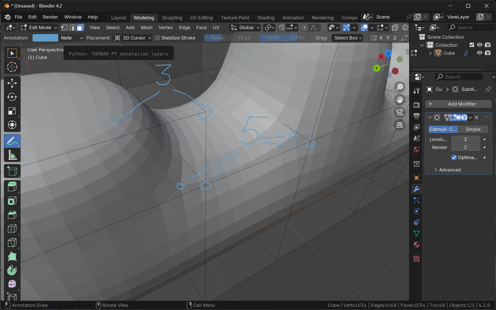
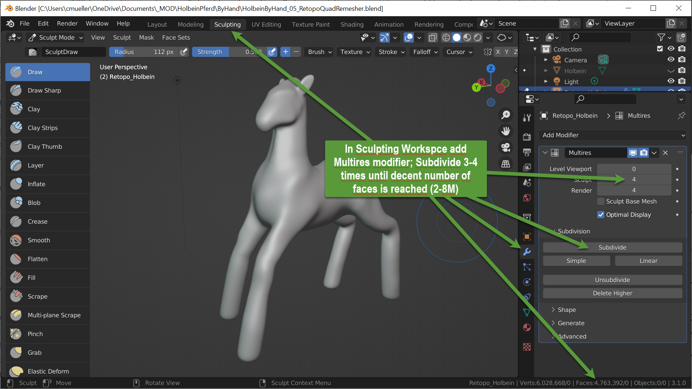
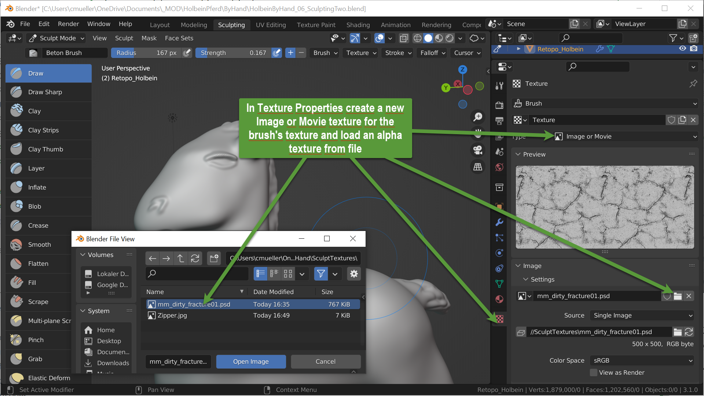

+++
title = 'Guerilla Guide to Modeling II'
draft = false
weight = 30 
+++

## 4. Retopologisierung

Mit den bis jetzt dargestellten Mitteln kann die gewünschte *Geometrie*
(die Form) erreicht werden. Für ein brauchbares Modell - insbesondere,
wenn es in Echtzeit auf möglicherweise schwachbrüstiger Hardware
(Mobilgeräte) dargestellt werden soll - ist auch eine gute *Topologie*
wünschenswert. Dies beschreibt die Anzahl und Aufteilung der Flächen
(Faces, Polygons, Quads). Hier gilt es, vor allem folgende
Randbedingungen einzuhalten:

-   **So wenig wie möglich, so viel wie nötig.** Auch wenn aktuelle
    Grafikhardware in der Lage ist, mit großen Polygonzahlen umzugehen,
    hat in Echtzeitumgebungen nach wie vor die Gesamtzahl der pro Frame
    zu rendernden Flächen einen direkten Einfluss auf die
    Ausführungsgeschwindigkeit. Umso mehr, wenn Bone-Animationen zum
    Einsatz kommen
-   **Quads.** Eine gute Topologie zeichnet sich dadurch aus, dass nur
    Vierecke (Quads) verwendet werden. Dreiecke, Fünf- oder Mehrecke
    sind zu vermeiden.
-   **Edge Flow.** Die Anordnung der Vierecke definiert den Fluss, in
    dem Kanten und Quad-Streifen über die Geometrie verläuft.
    Insbesondere bei Bone-Animationen ist dieser Edge-Flow von
    Bedeutung, um eine größtmögliche Bewegungsfreiheit zu ermöglichen.
    Bei schlechtem Edge-Flow können bei bestimmten Bewegungen durch die
    Bone-Animation Flächen ineinander geraten. Ebenso wirkt sich ein
    guter Edge-Flow auf die Unterteilung gering aufgelöster Modelle
    mittels Subdivision aus. [Video: Gegenüberstellung guter/schlechter
    Edge Flow](https://www.youtube.com/watch?v=Lip59doQQRk).

Um zu guter *guter* Topologie zu kommen, muss die Geometrie
*retopologisiert* werden. Dies kann von Hand geschehen oder mit Hilfe
automatisierter Werkzeuge

### Retopologisierung von Hand

Die größte Freiheit aber auch den größten Aufwand stellt die
Retopologisierung von Hand dar. Dabei wird die bestehende Geometrie mit
neuer Topologie Quad für Quad nachgezeichnet. Um den Prozess zu
vereinfachen, können zwei Mechanismen verwendet werden.

-   Snapping auf Face-Ebene. Damit werden alle Positionsänderungen von
    Eckpunkten der neuen Topologie auf die bestehende Geometrie
    projiziert. Somit kann die neue Topologie auf die alte "aufgemalt"
    werden

-   Polybuild-Werkzeug. Dieses Werkzeug (im Edit-Modus) vereint die beim
    Erzeugen neuer Topologie am häufigsten verwendeten Schritte in nur
    einem Tool:

    -   Extrudieren neuer Flächen aus bestehenden Kanten
    -   Umpositionieren von Eckpunkten
    -   Neuen Quad zwischen zwei über Eck begrenzenden Quads einfügen
    -   Löschen von Punkten, Kanten und Flächen

Diese Technik wird in zahlreichen Tutorials beschrieben, u. a.
[hier](https://www.youtube.com/watch?v=BEwEWKOH5ws).

#### Vorbereitung

-   Ein neues Objekt einfügen, am besten eine Plane
-   In den Modeling Workspace gehen -\> Edit-mode wird eingestellt
-   Snapping aktivieren und auf "Face" einstellen

#### Mit dem Poly Build tool arbeiten

#### Praktische Tipps für die Retopologisierung

- Wichtigste Loops zuerst einfügen
- Die meisten Vertices werden von vier Quads geteilt
- Dreier-, Fünfer und Sechser-Vertices mit Bedacht setzen
  - Dreier-Vertices bilden Eckpunkte von Quaderförmigen Begrenzungsgeometrien
  - Fünfer-Vertices treten bei extrudierten "Auswüchsen" (Arme, Beine, Extremitäten) auf, und zwar in den 90° Innen-Ecken.
  - Sechser-Vertices treten an Verzweigungen von zwei gleichzeitigen "Auswüchsen" auf.

##### N → M Übergänge

Wenn du Quad-Topologie in einer bestimmten Richtung mit einer Anzahl von Quads (n) anlegst, ist es oft erforderlich, diese Anzahl zu ändern. Wird die Geometrie entlang der Fortschrittsrichtung kleiner, muss die Breite der fortschreitenden "Quad-Front" aus weniger (m) Quads bestehen, oder umgekehrt (falls die Geometrie größer wird). Stell dir vor, eine zylindrische Quad-Front entlang eines Beins fortzusetzen. An Stellen, an denen das Bein dünner wird, möchtest du, dass die Zylinderringe aus weniger Quads bestehen. Wie reduzierst du die Anzahl der "Spuren" im Kanten-/Polygonfluss, ohne Dreiecke oder N-Gons einzufügen?

**Die schlechte Nachricht:** Es ist unmöglich, von einer geraden zu einer ungeraden Quad-Anzahl oder umgekehrt zu wechseln, ohne Dreiecke oder n-Gons einzufügen.

**Die gute Nachricht:** Fast jeder (n → m)-Übergang, bei dem _beide_, n _und_ m entweder gerade oder ungerade sind, kann auf einen 2 → 4 (oder 4 → 2) Übergang reduziert werden.

Das folgende Bild zeigt einen 2 → 4 Übergang. Die roten Pfeile zeigen die Fortschrittsrichtung.

Das kannst du leicht zu einem 2 → 6 Übergang erweitern, indem du eine zweite Spur zum inneren U-Turn-Quad-Fluss hinzufügst. Dadurch enthält dieser Übergang einen seltenen Fall, bei dem ein Pol mit sechs verbindenden Kanten akzeptabel ist (Aufgabe: Finde ihn!).

Als Beispiel für einen Übergang zwischen ungeraden Zahlen zeigt das folgende Bild gleichzeitig einen 1→3 Übergang, der als Kern eines 3→5 Übergangs betrachtet werden kann.

##### Denk an Subdiv: 3- und 5-Poles

Beobachte, wie ein Subdivision Surface Modifier an fast jedem Teil der Geometrie schöne 4-Kanten-Scheitelpunkte erzeugt. Die einzige Ausnahme sind Stellen, an denen die Kontrollgeometrie Ecken (3-Poles) und Extrusionen (5-Poles) enthält. Nutze diese Regel für deine manuelle Retopologisierung.

###### 3-Poles bei Kappen und Deckeln

An Stellen, an denen ein länglicher Teil des Objekts mit einer kappen- oder deckelartigen Schließung endet, enthält die Kante, die die Grenze zwischen der lateralen Oberfläche und der Kappe bildet, typischerweise bis zu vier 3-Poles (Scheitelpunkte mit nur drei verbindenden Kanten), während alle anderen Scheitelpunkte vier Kanten verbinden.

###### 5-Poles bei Extrusionen und Extremitäten

Eine Kante, die die Grenze zwischen einem Basisteil und einem aus dem Objekt extrudierten Teil (wie dem Körper und einem Arm einer Figur) bildet, enthält typischerweise bis zu vier 5-Poles.

##### Verwende Grid Fill für Kappen

Um einen länglichen Teil mit einer Kappe zu schließen, verwende den Grid Fill-Befehl (funktioniert nur, wenn die begrenzende Edge-Loop aus einer geraden Anzahl von Quads/Kanten besteht).

### Automatische Retopologisierung

Da die Retopologisierung von Hand aufwändig ist und viel Erfahrung
benötigt, gibt es zahlreiche Blender Add-ons, die auf Knopfdruck
retopologisieren können. Ein sehr brauchbares, allerdings
kostenpflichtiges Add-on ist der [Quad Remesher von
Exoside](https://exoside.com/quadremesher/).

#### Quad Remesher installieren

#### Quad Remesher anwenden

## 5. Details mit Multires-Sculpting ausarbeiten

Mit dem bereits in Schritt 3 verwendeten Sculpting-Werkzeug können nun
Details wie z. B. Gesichtspartie, angedeutete Haare auf der Mähne und am
Schweif, sowie Gesteinsstrukturen in die Oberfläche modelliert werden.

### Multiresolution verwenden

Um die in diesem Schritt notwendige Polygonzahl zu erreichen, muss auf
dem retopologisierten Objekt der Multiresolution Modifier angewendet
werden. Dort sollten so viele Unterteilungen vorgenommen werden, bis eine
für feinste Strukturen geeignete Auflösung erreicht ist. 2-8 Millionen
Faces sind hier nicht unüblich.

#### Multiresolution einrichten

<!--  -->

### Mit Brushes (Alphas) arbeiten

Zusätzlich zu den bereits in 3 vorgestellten Sculpting-Werkzeugen kann
es interessant sein, mit Brush-Texturen zu arbeiten (so genannte
*Alphas*). [Viele dazu geeigente Texturen finden sich z. B. auf der
Website des Herstellers der Software Z-Brush,
Pixologic](https://pixologic.com/zbrush/downloadcenter/alpha/).

#### Alpha-Brush einrichten

#### Alpha-Brush Textur laden

#### Alpha-Brush Textur anwenden

## 6. Details als Normalen-Map auf Low-Poly-Version backen

Das nun extrem hoch aufgelöste Modell kann auf eine niedrig aufgelöstere Version heruntergebrochen werden, wobei Details der hohen Auflösung mit Hilfe einer Normalen-Map auf die niedrig aufgelöste Variante aufgebracht wird. Dadurch verhält sich das niedrig aufgelöste Modell für die Beleuchtungsberechnung wie das hoch aufgelöste Modell.

#### Low-Poly Version erzeugen

Durch den Multiresolution-Modifier sind mehrere Auflösungsstufen gleichzeitig vorhanden. Für das niedrig aufgelöste Modell wird eine Kopie angelegt, die Änderungen aus dem Sculpting angewendet, soweit es die niedrige Polygonzahl erlaubt und der Multires-Modifier entfernt.

#### Unwrap Lo-Poly Geometrie, um Texturkoordinten (UVs) zu erzeugen

Um die zu generierende Normalen-Map auf das niedrig aufgelöste Modell als Textur anwenden zu können, müssen Texturkoordinaten generiert werden. Das UV-Unwrapping ist, wie das Sculpting und das Retopologisieren von Hand eine zeitaufwändige Fleißarbeit. Auch hier gilt: Je sorgfältiger, desto besser das Modell. Zur Demonstration wird hier ein automatisches UV-Unwrapping verwendet, das meist keine sehr guten Ergebnisse liefert.

Ein paar Einblicke über Techniken und Werkzeuge für gutes UV-Unwrapping liefert z. B. [dieses Tutorial](https://www.youtube.com/watch?v=8qv6DbWr6zw).

#### Lo-Poly-Material vorbereiten und leere Normalen-Textur erzeugen

#### Im Lo-Poly-Material Textur-Node als "Normalen-Empfänger" anlegen

#### Die Normalen-Textur backen

#### Normalen-Textur anwenden und Resultat überprüfen

## 7. Zur Belohnung ein Pferdle-Pils

<https://www.beer-lodge.com/products/beer-lodge-pferdle-pils-callista-hop>

Gebraut von einer Furtwanger Medieninformatik-Diplom-Absolventin
(Abschluss-Jahrgang 1996)

3D-Modell-Pferdle im Logo gescannt und per Photogrammetrie
3D-rekonstruiert von einem Furtwanger
Medieninformatik-Master-Absolventen (Abschluss-Jahrgang 2016)

