+++
title = '3D Reconstruction (SFM)'
draft = false
weight = 50 
+++

## 1. Bilder aufnehmen

- Für ambiente Beleuchtung sorgen. Raum mit viel Licht und hellen Wänden. Ggf. durch indirekte Beleuchtung nachhelfen. Wenn möglich Tageslicht-Softboxen verwenden
- Objekt sollte an Aufnahmestelle keine Schlagschatten werfen
- Objekt so platzieren, dass es von allen Seiten zugänglich ist
- Mind. einen Kreis um das Objekt aufnehmen (blau)
  - Alle 10° ein Bild: 36 Aufnahmen pro Kreis
  - Blickrichtung möglichst horizontal (nicht von oben nach unten)
- Ggf. zweiten Kreis leicht von oben mit leicht nach unten geneigtem Blickwinkel: weitere 36 Bilder. Den ersten Kreis dann eher leicht von unten nach oben geneigt aufnehmen.
- Vier 180°-Bögen (alle 45° einen Bogen) über das Objekt mit 10-20 Bildern pro Bogen (rot/grün)
- [Hilfs-Untergrund mit 10°- und 45°-Kreiseinteilung verwenden](img/ScanningCompas.pdf), um Überblick bei den Aufnahmen zu behalten.
  
- Um die Bilder zu schießen, mit Kamera um das Objekt laufen. Nicht das Objekt drehen
- Falls erwünscht: Gleiche Prozedur für die Rückseite (Standfläche der ersten Aufnahme). 
- Entscheiden, ob Bilder nachbearbeitet/angeglichen werden sollen: 
  - Falls ja (mehr Arbeit, bessere Ergebnisse): 
    - Raw aufnehmen
    - Gleiche Aufnahmeparameter für alle Bilder (Belichtungszeit, Blende, ISO, Helligkeit)
    - Farbkarte verwenden
  - Falls nein (weniger Arbeit, weniger Kontrolle über Rekonstruktionsergebnis): 
    - JPG aufnehmen
    - MÖGLICHST gleiche Aufnahmeparameter für alle Bilder (Belichtungszeit, Blende, ISO, Helligkeit)
- Unschärfe im Objekt unbedingt vermeiden. Soweit möglich, Unschärfe auch in der Umgebung vermeiden

  
## 2. Bilder nachbearbeiten (optional)

Ziele: 
- Bei Raw: Bilder mit gleichem Farb-Mapping erzeugen: Gleiche Bereiche in unterschiedlichen Bildern sollen die selbe Farbwirkung haben
- De-lighting: Farben mit möglichst wenig Beleuchtungseffekten (Schatten, Diffuse, Glanz, Ambient Occlusion) darstellen

Schritte
- Dazu eine digitale Entwicklungssoftware mit Bulk-Optionen wie z. B. die kostenlose Software Darktable verwenden
- Weißpunkt/Schwarzpunkt definieren:
- Farbzuordnung ggf. anhand Farbkarte
- Alle gestalterischen Prozessschritte ("filmic") ausschalten
- Pseudo-De-lighting: mit Exposure und tone-equalizer Dunkle Bereiche aufhellen und helle Bereiche abdunkeln
- Ggf. schärfen

### Beispielprozedur für die Vorbereitung von JPG-Aufnahmen mit Darktable

- Bilder importieren:
  - Alle gewünschten Bilder im Ordner mit CTRL+A auswählen.
  - Per Drag & Drop in darktable einfügen.

- Referenz-Bild zur Bearbeitung auswählen:
  - Ein Bild mit gutem Fokus auf das Objekt und guten Lichtverhältnissen wählen.
  - In den „darkroom“-Modus wechseln.

- Software-Einstellungen überprüfen:
  - In den Einstellungen unter storage > xmp die Option „write sidecar file for each image“ deaktivieren (vermeidet unnötige .xmp-Dateien).
  - „filmic rgb“ und „base curve“ deaktivieren (natürlichere Darstellung).
    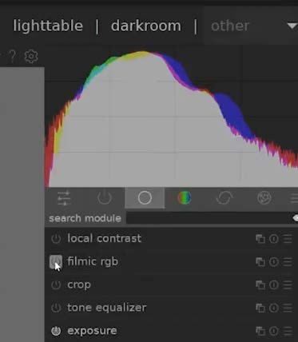

- Bildbearbeitung des Referenzbildes:
  - White Balance: 
    - Mit dem Eyedropper-Tool ein neutrales Grau im Bild auswählen.
      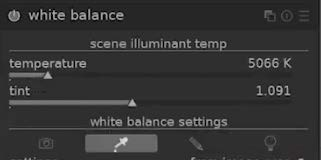
  - Exposure (Belichtung):
    - Schatten aufhellen, um Details besser sichtbar zu machen.
  - Tone Equalizer:
    - Helle und dunkle Bereiche ausbalancieren (Pseudo-Delighting).
  - Sharpen (Schärfen) - optional:
    - Objektkanten und Texturdetails hervorheben.

- Bearbeitungen auf andere Bilder übertragen:
   - Zurück zum Übersichtsmenü.
   - „Selective Copy“ → alle vorgenommenen Einstellungen auswählen.
   - Mit `CTRL+A` alle Bilder markieren.
   - „Selective Paste“ → Einstellungen auf alle Bilder anwenden.
     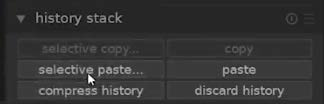

- Export der fertigen Bilder:
  - Klare Ordnerstruktur anlegen (importierte und exportierte Bilder in getrennten Ordnern).
  - Exportformat: TIFF (Detailerhalt).
  - Optional: Bildgröße über „set size“ begrenzen (für Tests & kleinere Dateigröße).

→ Bilder sind bereit für den Structure-From-Motion-Prozess (SFM).

## 3. Bilder nach Reality Capture importieren

- Neues, leeres Projekt
- Im Alignment-Menüband → Settings → Image downscale factor auf 1 (Standard). Ggf., bei sehr vielen sehr großen Bildern den Faktor vergrößern (und damit die Bilder verkleinern).
- Bilder per Drag and Drop oder per Workflow-Riboon → Inputs auswählen. Im Objekt-Baum des "1Ds"-Fenster sollten die Bilder unter Inputs erscheinen.
  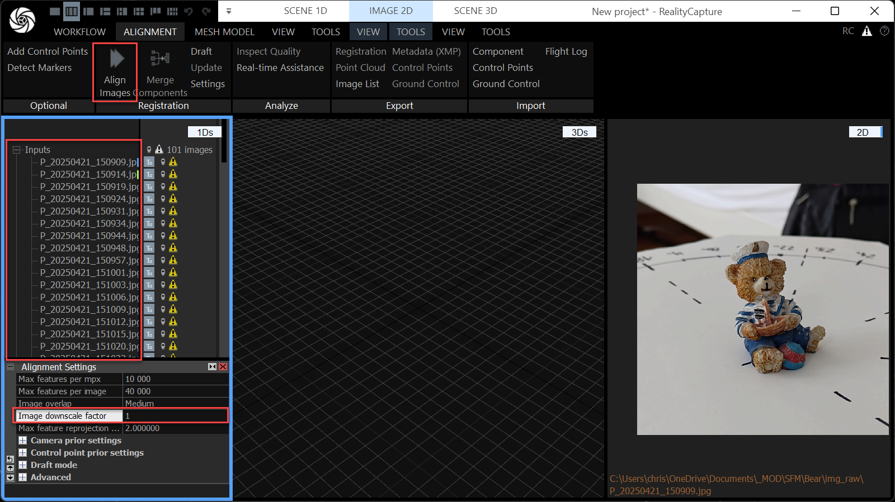

## TODO: Prozess bei zweigeteilter Aufnahme von Oben und Unten

- TODO: Rekonstruktion eines von oben und unten erfassten 3D-Modells und Masken-Generierung
  wie in [diesem Tutorial](https://www.youtube.com/watch?v=4qFl4k37dDc) beschrieben.

## 4. Kamera-Positionen und Punktwolke rekonstruieren und ausrichten

- Im Alignment-Menüband → Align Images selektieren.
- Wenn die Aufnahmen geeignet waren, erscheint eine Punktwolke des Objektes und die Kamerapositionen durch angedeutete Sicht-Pyramiden. Zudem erscheinen orangene Linien an den Kameras, die die Abweichung von der rekonstruierten Position zu ggf. vorliegenden GPS-Informationen zeigen. Diese sind für die Indoor-Rekonstruktion kleiner Objekte nicht relevant und sollten über "Scene 3D" → "Alignment Cameras" → Residuals ausgeschaltet werden.
- Die gesamte Szene ist möglicherweise schief im Raum dargestellt. Um diese auszurichten, muss gleichzeitig im Raum navigiert werden und die "Ground Plane" angepasst werden.
- Navigation in 3D
  - Rechte Maustaste + Mausbewegung: Kamera drehen
  - Links Doppelklick: Drehpunkt (Pivot) festlegen
  - Linke Maustaste + Mausbewegung: Bewegung der Kamera über die Szenen Ebene. Mit gleichzeitig gedrückter Ctrl-Taste: Bewegung der Kamera in der Bildschirm-Ebene
  - Mausrad: Zoom
  - "Scene 3D" → "View" → "View Camera" → "Perspective"-Ausklapp-Fenster erlaubt das Ändern auf orthografische Ansichten entlang der Hauptachsen (wie z. B. Top/Front/Left...).
  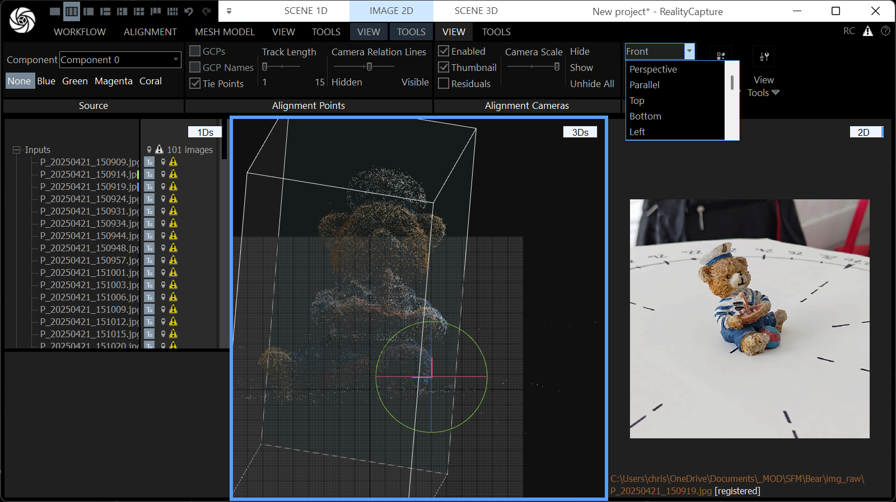
- Ausrichten der "Ground Plane"
  - Unter "Scene 3D" → "Tools" → "Scene Alignment" → den "Set Ground Plane" Button aktivieren.
  - Es erscheint ein 3D-Positionierungs und Rotations-Gizmo, mit dem die gesamte Szene (Punktwolke und Kameras") verschoben und um den Pivot-Punkt gedreht werden kann.
  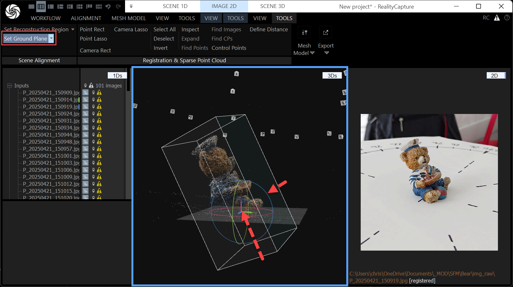
- Ist die Szene mittig platziert und korrekt ausgerichtet (Kamera-Halbkugel über dem Objekt. Objekt steht korrekt gedreht in der Szene), kann die "Reconstruction Region" gesetzt werden. Durch das Drehen der ganzen Szene ist diese nun eventuell schief im Raum verdreht
- Mit "Scene 3D" → "Tools" → "Scene Alignment" → "Set Reconstruction Region" → "Set Region Automatically" wird die Region (dargestellt als Box) wieder entlang der Hauptachsen um die Punktwolke ausgerichtet. Dann kann sie mit den bunten Anfassern vergrößert oder verkleinert werden. Auch hier helfen die parallelen Seitenansichten.
  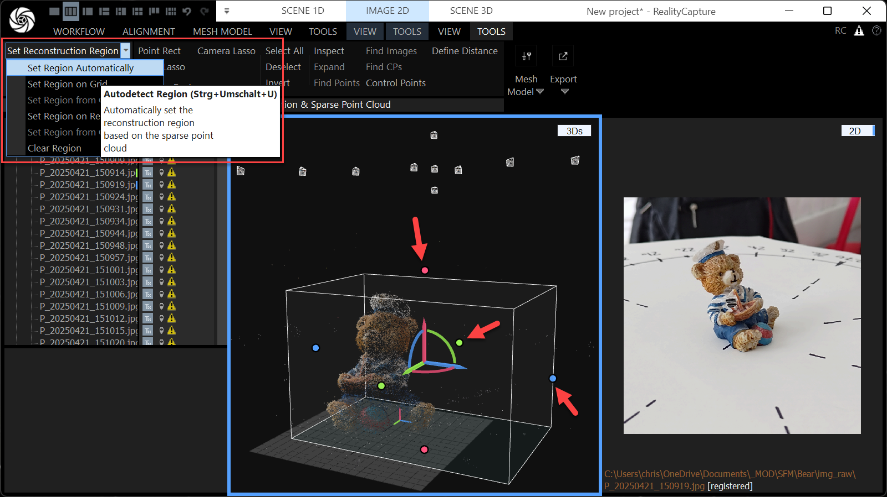

## 5. Modell rekonstruieren, bearbeiten, texturieren und exportieren

- Im "Mesh Model"-Menüband → "Create Model"-Abschnitt" → "Settings" einschalten. Dort dann unter "Image depth map calculation" → "Normal Model" → die "Image Downscale"-Eigenschaft auf 1 stellen. Dadurch werden exaktere Modelle erstellt, die Rechenzeit erhöht sich aber auch.
- Dann durch Drücken auf den "Normal Detail"-Button den 3D-Modell-Rekonstruktionsprozess in normaler Genauigkeit starten.
  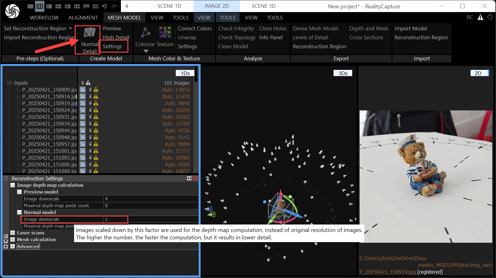
  **→ Ein 3D-Modell sollte erscheinen**
- Das Modell umbenennen, da im weiteren Prozess noch mehrere 3D-Modelle verwendet werden.
  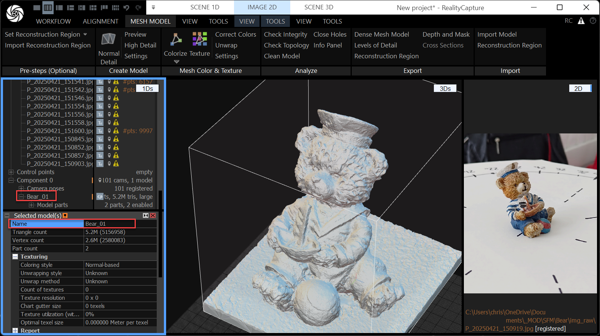
- Im "Scene 3D" → "Tools"-Menüband, im  "Mesh Model"-Abschnitt das "Lasso" Werkzeug auswählen und mit gedrückter `Ctrl`-Taste Bereiche des 3D-Mesh auswählen, die nicht zum Modell gehören. Ausgewählte Bereiche erscheinen orange.
- Dann mit "Filter Selection" die orange-farbenen Teile entfernen.
  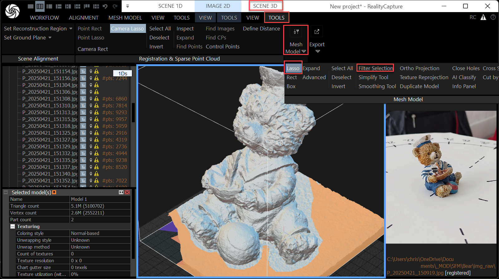
- Jeder "Filter Selection"-Aufruf erzeugt ein neues Modell. Alle zwischen-Modelle löschen und das endgültig gefilterte Modell aussagekräftig umbenennen.
- Mit "Workflow" → "3. Output" → "Export" das Modell in eine FBX-Datei exportieren

## 6. Modell fixen, Low-Poly Version erzeugen

- Das FBX-Modell in Blender importieren. 
- Vorhandene Löcher Schließen (wasserdicht machen). Dazu gibt es mehrere Methoden:
  1. Rand-Edges eines Lochs markieren (bei kleinen, aus wenigen Kanten bestehenden Löchern) und mit F (Fill) schließen.
  2. Mittels "Collapse" (ebenfalls kleinere Löcher, aber ggf. schon aus vielen Kanten bestehend): Im Edit-Mode fürKanten mit dem Lasso-Werkzeug grob die um das Loch positionierten Kanten selektieren. Dann "X" drücken und "Collapse Edges and Faces" auswählen.
  3. Fehlende Geometrie als Positiv- oder Negativ-Form grob nachbauen. Mit Boolean dann mit dem Original-Objekt verbinden/abschneiden.
  - Dabei entstehende große Polygone mit vielen Kanten und möglicherweise vielen konkaven Einbuchtungen triangulieren.
  - Mit 2. oder 3. ergänzte Geometrie mittels Sculpting und Dyntopo verfeinern.
- Low-Poly-Version erzeugen. Dazu gibt es zwei Methoden
  1. Mit dem "Decimate" Modifier den Ratio anpassen, bis in etwa der gewünschte Grad erreicht wurde.
  2. Retopologisieren, z. B. mit dem (kostenpflichtigen) Add-On "Quad Remesher".
- "Wasserdichte" Low-Poly Version als FBX exportieren

## 7. Texturen in Reality Capture backen und exportieren

- "Mesh Model"-Menüband → "Mesh Color & Texture"-Abschnitt → "Settings" aufrufen. Dann in den "Color and Texture Settings die Einstellungen "Downscale images before texturing", sowie "Downscale...coloring" jeweils auf 1 stellen.
- Das wasserdichte Hi-Poly-Modell unter "Mesh Model" → "Import" → "Import Model" importieren. Importiertes Modell umbenennen (z.B. "xyz_watertight_hipoly").
- Dann im gleichen Menüband-Abschnitt den Knopf "Texture" drücken. Es wird eine Textur erstellt. Falls das nicht auf Anhieb klappt, vorher noch mal "Unwrap" drücken und im "Unwrap Tool" das Unwrapping auslösen.
- Wenn das Hi-Poly-Modell texturiert erscheint, kann das Lo-Poly-Modell geladen importiert werden.
- Auch hier muss zunächst eine UV-Map mittels "Unwrap" erzeugt werden. Zur Kontorlle kann im "Unwrap Tool" eine "Checkerboard" Texur erzeugt werden.
- Dann wird im "Scene 3D"-Abschnitt im "Tools"-Menüband im "Mesh Model"-Abschnitt der Befehl "Texture Reprojection" ausgelöst.In den Einstellungen "Reproject model texture"
  - Bei "Source model" das texturierte Hi-Poly-Modell wählen
  - Bei "Result model" das Lo-Poly-Modell (mit erfolgreichem Unwrapping) wählen
  - "Normal reprojection" aktivieren ("Enable")
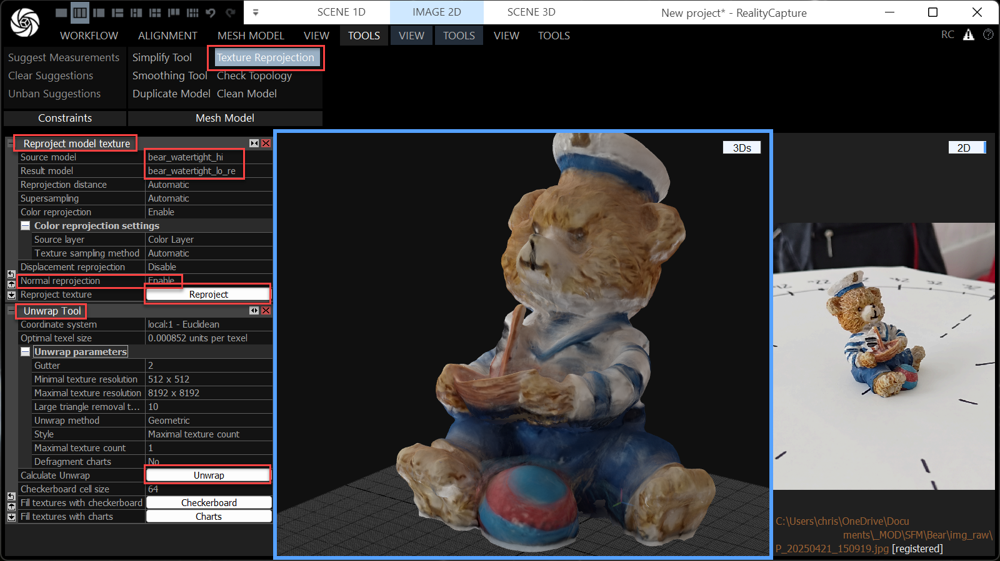
**→ das Low-Poly-Modell sollte mit der Farb-Textur dargestellt werden**
- In den Textur-Eigenschaften des Lo-Poly-Modells einen eventuell noch vorhandenen Checkerboard-Color-Layer löschen.
- Über "Workflow" → "3. Output" alles als FBX exportieren
- In Blender kontrollieren, ob das Modell inklusive Farb- und Normalen-Textur importiert werden kann.

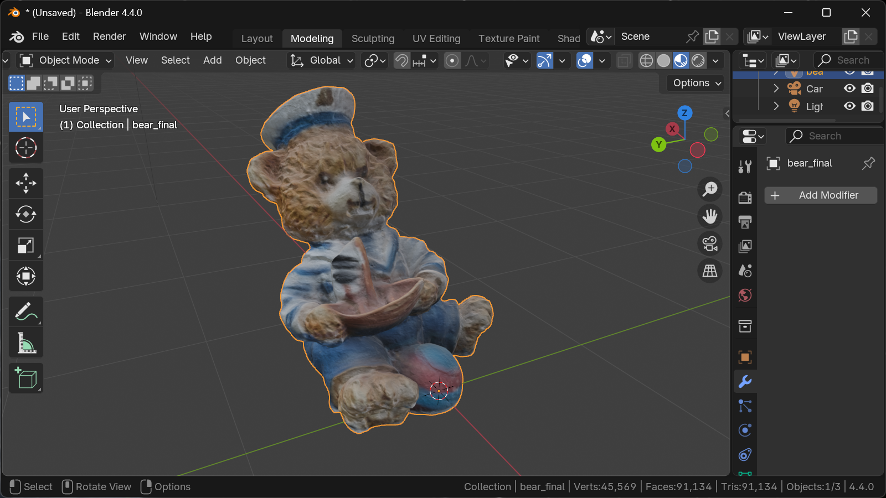

<!--
- Bestand das Lo-Poly-Modell aus Quads (z. B. weil es mit QuadRemesher Retopologisiert wurde, wurden beim Re-Import des Lo-Poly-Modells in Reality Capture aus allen Quads wieder Tris. Diese lassen sich nun in Blender im Edit-Mode mit dem Befehl "Face" → "Tris to Quads" (`Alt`+`J`) wieder in Quads zurückverwandeln.
-->

