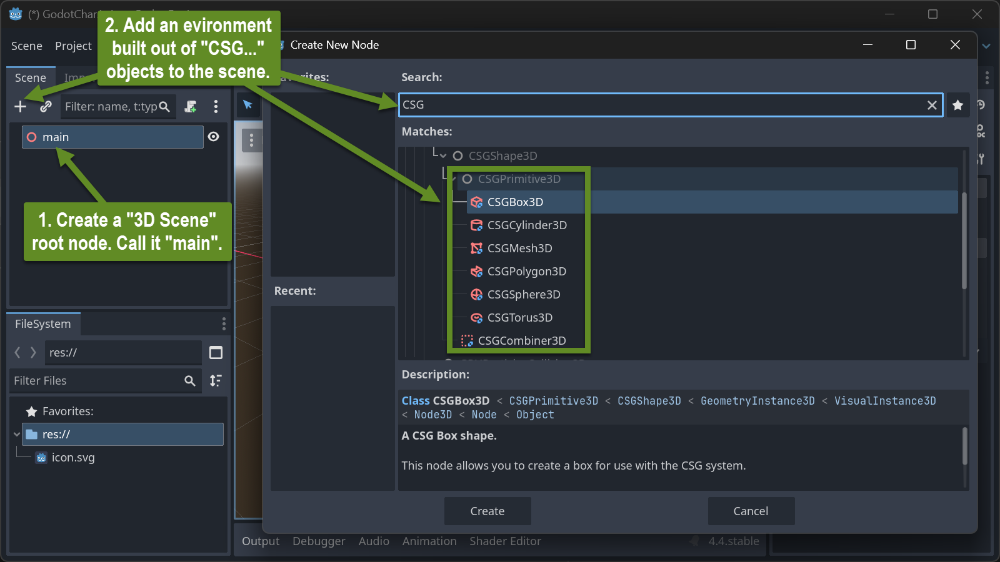
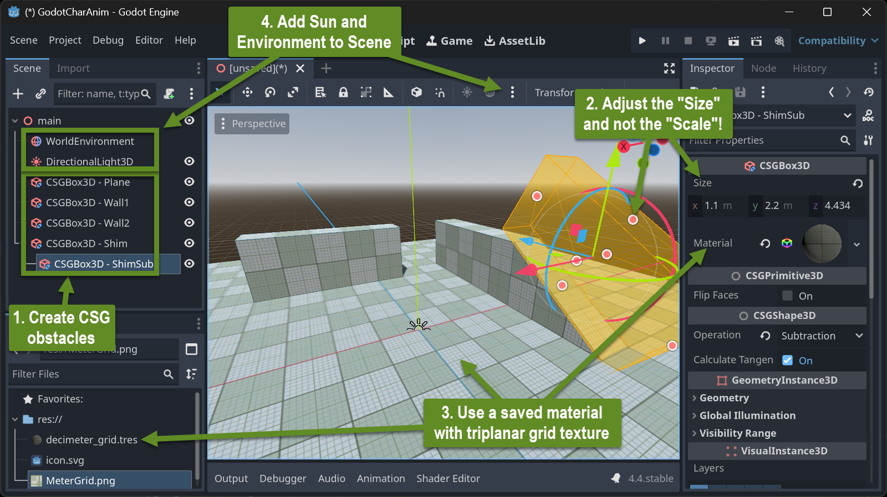
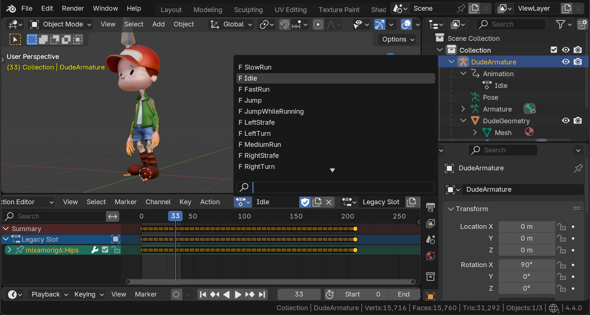
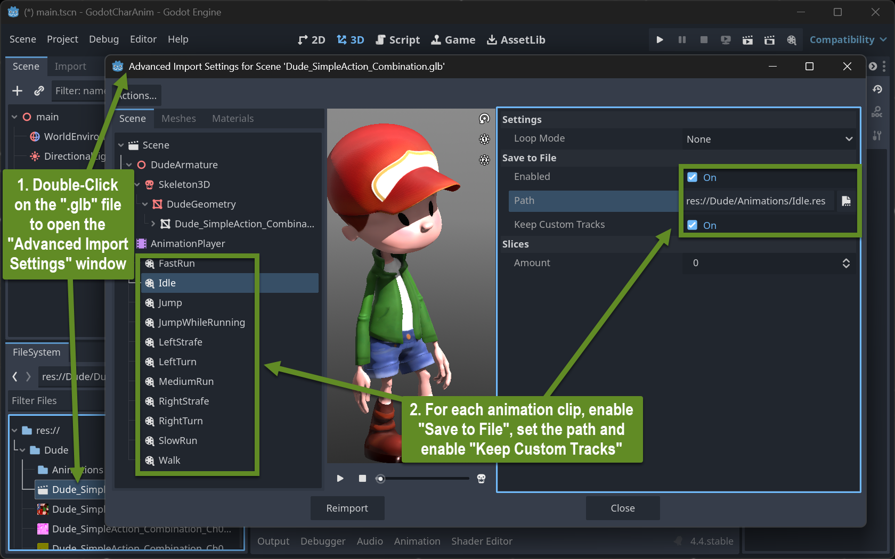
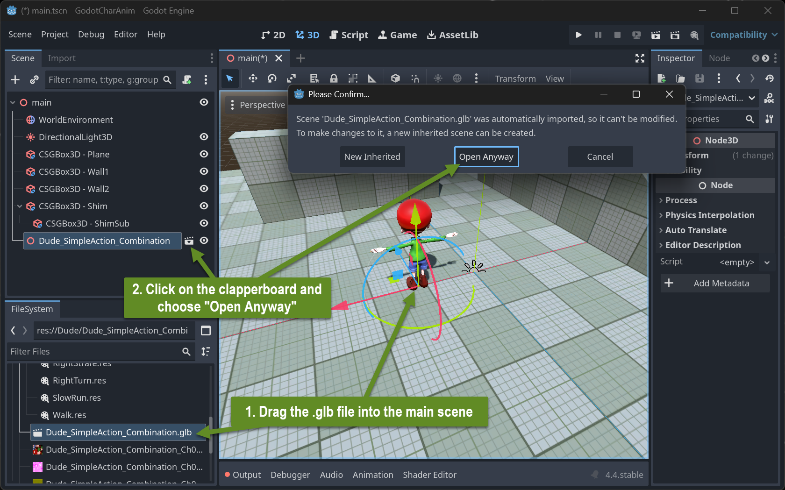
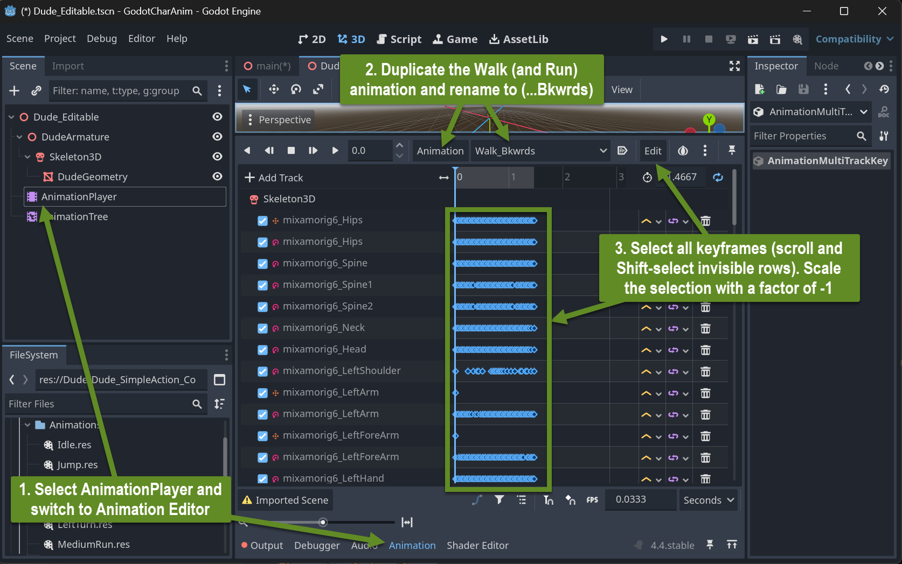
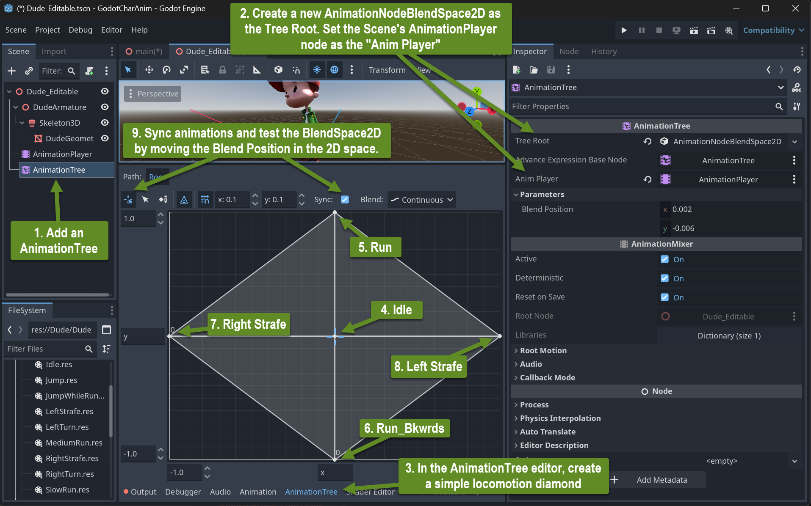
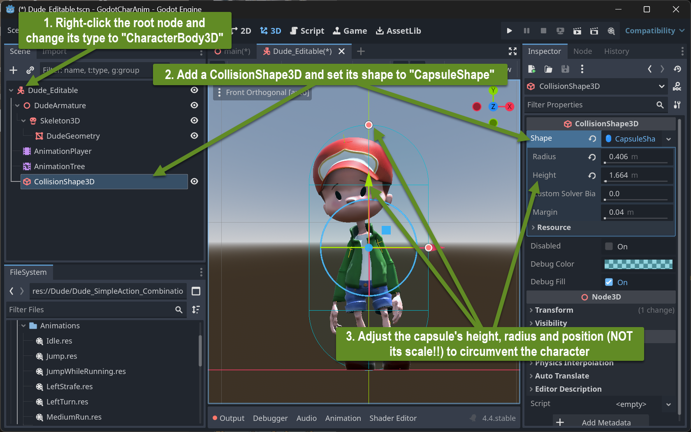
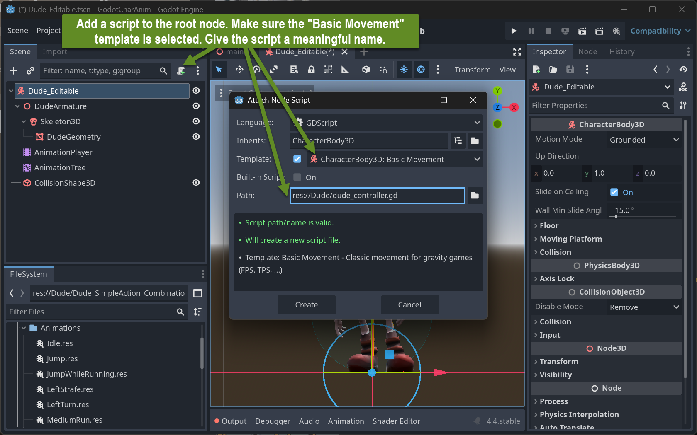
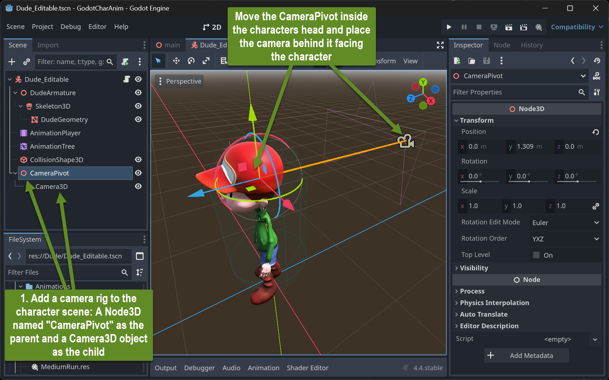

+++  
title = 'Character Animation Basics'  
draft = false  
weight = 60  
+++  

## Inhalte  

- Einrichten einer 3D-Testumgebung (Player-Playground) in Godot  
- Hinzufügen eines Charakters mit Mixamo-Animationen  
- Einrichten eines Charakter-Controllers  

## Einrichten einer 3D-Testumgebung in Godot  

### Aufbau eines Playgrounds aus CSG-Objekten  

#### Szenenaufbau  

  

CSG steht für "Constructive Solid Geometry". Diese Objekte sind nur für das schnelle Prototyping einer 3D-Szenenumgebung gedacht! Verwendet sie nicht in der Produktion. Sie bieten eine schnelle Möglichkeit, einfache Formen mit booleschen Operationen zu erstellen. Außerdem sind sie bereits statische Körper für die Physiksimulation von Godot.  

#### Ein einfacher Playground  

Erstellt eine einfache Szene, die aus einer CSG-Bodenebene und einigen CSG-Hindernissen besteht, auf die man klettern und springen kann.  

  

- Verwendet eine Meter-Skalierung für eure zukünftigen Charaktere, wobei davon ausgegangen wird, dass ein typischer Zweibeiner zwischen 1 m und 2 m groß ist.  
- Verwendet nicht die Eigenschaft "Node3D/Transform/Scale" der Objekte, um deren Größe anzupassen. Verwendet stattdessen die Eigenschaft "CSG*Box*3D/Size"! Andernfalls funktioniert die Physik-Engine nicht korrekt.  
- Weist euren Umgebungsobjekten ein Material mit der - ["Dezimeter-Gitter"-Textur](img/MeterGrid.png) zu und lasst es triplanare UVs generieren (unter der UV1-Einstellung des Materials). Stellt es auf "World Triplanar" und passt die Skalierung an, damit das Gitter in Metern erscheint.  

## Importieren und Kombinieren mehrerer Knochenanimationen von Mixamo

Mixamo unterstützt nur FBX (verschiedene Dialekte) und Collada (DAE). Verwendet FBX! Der Collada-Export sieht in Blender - zumindest für das 3D-Modell (Skin) - unschön aus.

In Mixamo können verschiedene Animationen mit demselben 3D-Charakter heruntergeladen werden – jede als einzelne Datei. In Blender sollten dann alle Animationen als sogenannte "Actions" auf demselben Charakter (Armature) vereint werden:

### Voraussetzung

- Alle Animationen sind als FBX-Datei MIT Skin heruntergeladen.
- Alle Fortbewegungs-Animationen sind mit gesetztem "In-Place" Flag heruntergeladen.

### Animationen als Action-Tracks kombinieren (einfachere Methode)

- Importiert die erste Mixamo-Datei.
- Wählt im Dope-Sheet-Editor den "Action Editor" aus.
- Benennt die Action und den Slot in der Kopfzeile des Action Editors in aussagekräftige Namen um. Merkt euch den Slot-Namen.
- Für jede weitere Mixamo-Datei:
  - Importiert die nächste Mixamo-Datei – dasselbe Modell ist jetzt zweimal in der Szene vorhanden, jedes mit seiner eigenen Animation.
  - Wählt das gerade importierte Armature aus.
  - Benennt den gerade importierten Animationsclip um (kann in der Kopfzeile des Action Editors oder im Outliner erfolgen).
  - Benennt den gerade importierten Slot-Namen exakt in den Slot-Namen um, der für die erste importierte Mixamo-Datei vergeben wurde.
  - Wählt das Armature aus, das alle Animationen sammelt.
  - Wählt in der Kopfzeile des Action Editors aus dem Dropdown-Menü den zu importierenden Clip aus, der gerade umbenannt wurde.
  - Löscht das importierte Armature und die Charakter-Geometrie.


### Import eines animierten Charakters  

#### Vorbereitung  

- Weist alle relevanten Animationen auf eurem einzelnen Charakter-Armature/Mesh als Aktionen in Blender zu, wie im vorherigen Abschnitt beschrieben.  
- Entfernt alles aus der Blender-Datei, das nicht Teil des animierten Charakters ist (z. B. Lichter und die Kamera).  
- Exportiert das Armature und das enthaltene/gesteuerte Mesh einschließlich Animationen in das glTF-Format in binärer Form und erstellt eine ".glb"-Datei. Stellt sicher, dass die Datei alle verwendeten Texturen des Charaktermodells enthält.  
- Verschiebt die glb-Datei in den Godot-Projektordner (oder einen seiner Unterordner).  

  

Wenn ihr den Godot-Editor mit dem geöffneten Projekt aktiviert, importiert Godot die glb-Datei. Dabei werden auch alle Texturen innerhalb des Modells als einzelne Dateien im Projekt-(Unter-)Verzeichnis extrahiert.  

- Passt die Importeinstellungen an: Öffnet die erweiterten Importeinstellungen und lasst Godot alle Animationsclips in einzelne ".res"-Dateien speichern:  

  

### Aufbau eines Charakters  

#### Einrichtung von AnimationPlayer und AnimationTree  

Zieht die ".glb"-Datei in eure Haupt-3D-Szene. Der Charakter in seiner T-Pose sollte erscheinen. Um bestimmte Aspekte des Modells bearbeitbar zu machen, erstellt eine neue Szene dafür: Klickt auf das Klappbrett-Symbol neben dem Knoten des Charakters in der Hauptszene. Ein Bestätigungsdialog erscheint. Wählt die Option "Trotzdem öffnen".  

  

Speichert die neu erstellte Szene mit einem aussagekräftigen Namen, z. B. mit dem Suffix "editable.tscn".  

Entfernt in der Hauptszene den gerade hinzugefügten glb-Charakter-Knoten und fügt stattdessen die "...editable"-tscn-Szene hinzu.  

Erstellt im AnimationPlayer der bearbeitbaren Szene Rückwärtsbewegungen für alle verwendeten Vorwärtsbewegungen, wie Gehen und Laufen.  

  

Fügt einen "AnimationTree"-Knoten direkt unter dem vorhandenen AnimationPlayer-Knoten hinzu.  
- Verkabelt die Einstellungen entsprechend.  
- Erstellt ein BlendSpace2D als Wurzel.  
- Richtet ein einfaches Bewegungs-Diamantmuster mit Idle, Vorwärts-, Rückwärts- und seitlichen Bewegungen ein.  

  

##### Erstellen eines Bewegungs-Skripts und Verknüpfung mit Animationen  

- Ändert den Typ des Wurzelknotens der Charakter-Szene in "CharacterBody3D".  
- Fügt eine CollisionShape3D-Kapsel hinzu.  

  

- Fügt dem Wurzelknoten ein grundlegendes Bewegungs-Skript hinzu.  

  

Das Code-Editor-Fenster öffnet sich und zeigt den folgenden GDScript-Code:  

```python  
extends CharacterBody3D  

const SPEED = 5.0  
const JUMP_VELOCITY = 4.5  

func _physics_process(delta):  
  # Add the gravity.  
  if not is_on_floor():  
    velocity += get_gravity() * delta  

  # Handle jump.  
  if Input.is_action_just_pressed("ui_accept") and is_on_floor():  
    velocity.y = JUMP_VELOCITY  

  # Get the input direction and handle the movement/deceleration.  
  # As good practice, you should replace UI actions with custom gameplay actions.  
  var input_dir = Input.get_vector("ui_left", "ui_right", "ui_up", "ui_down")  
  var direction = (transform.basis * Vector3(input_dir.x, 0, input_dir.y)).normalized()  
  if direction:  
    velocity.x = direction.x * SPEED  
    velocity.z = direction.z * SPEED  
  else:  
    velocity.x = move_toward(velocity.x, 0, SPEED)  
    velocity.z = move_toward(velocity.z, 0, SPEED)  

  move_and_slide()  
```  

Fügt eine Kamera zur Hauptszene hinzu, zuerst an der Wurzel mit Blick auf den Playground, später als Kind des Charakters, um einen sehr einfachen Third-Person-Controller zu simulieren, und versucht, die Szene auszuführen. Steuert den Charakter mit den Pfeiltasten. Springt mit der Leertaste.  

Passt die Reihenfolge der Eingabeereignisse (`"ui_left"`, ...) an, die den `input_dir`-Vektor erzeugen, damit die Pfeiltasten den Charakter in die erwarteten Richtungen bewegen.  

**Versucht, das Skript zu verstehen**  

Fügt vier globale Variablen vor der `_physics_process`-Methode hinzu:  

```python  
var locomotion_blend_path : String = "parameters/blend_position"  
@onready var animation_tree: AnimationTree = $AnimationTree  
var input_cur : Vector2 = Vector2(0, 0)  
var input_acc : float = 0.1  
```  

und fügt zwei Zeilen Code direkt nach der Deklaration und Zuweisung der Variablen `input_dir` hinzu:  

```python  
  input_cur += (input_dir - input_cur).clamp(Vector2(-input_acc, -input_acc), Vector2(input_acc, input_acc))  
  animation_tree.set(locomotion_blend_path, input_cur)  
```  

Die erste Zeile fügt eine Verzögerung bei abrupten Änderungen des `input_dir` hinzu. `input_cur` folgt `input_dir` mit einer gewissen Glättung.  

Die zweite Zeile weist diese geglättete Version von `input_dir` der aktuellen Position des AnimationTree's 2D-Lokomotions-Diamantmusters zu.  

#### Rotation und Maussteuerung hinzufügen  

Entfernt jede Kamera aus der Hauptszene und erstellt ein Kamera-Rig innerhalb der Charakter-Szene.  

  

Ändert das Charakter-Controller-Skript in das folgende (vollständiges Skript):  

```python  
extends CharacterBody3D  

const SPEED = 3.5  
const JUMP_VELOCITY = 4.5  
var camera_pan_speed : float = 0.003  

var locomotion_blend_path : String = "parameters/blend_position"  
@onready var animation_tree: AnimationTree = $AnimationTree  
var input_cur : Vector2 = Vector2(0, 0)  
var input_acc : float = 0.1  

func _ready():  
  Input.mouse_mode = Input.MOUSE_MODE_CAPTURED  

func _physics_process(delta):  
  # Add the gravity.  
  if not is_on_floor():  
    velocity += get_gravity() * delta  

  # Handle jump.  
  if Input.is_action_just_pressed("ui_accept") and is_on_floor():  
    velocity.y = JUMP_VELOCITY  

  # Get the input direction and handle the movement/deceleration.  
  # As good practice, you should replace UI actions with custom gameplay actions.  
  var input_dir = Input.get_vector("ui_right", "ui_left", "ui_down", "ui_up")  
  input_cur += (input_dir - input_cur).clamp(Vector2(-input_acc, -input_acc), Vector2(input_acc, input_acc))  
  animation_tree.set(locomotion_blend_path, input_cur)  
  var direction = (transform.basis * Vector3(input_dir.x, 0, input_dir.y)).normalized()  
  if direction:  
    velocity.x = direction.x * SPEED  
    velocity.z = direction.z * SPEED  
  else:  
    velocity.x = move_toward(velocity.x, 0, SPEED)  
    velocity.z = move_toward(velocity.z, 0, SPEED)  

  if Input.mouse_mode == Input.MOUSE_MODE_CAPTURED:  
    # Handle Mouse speed to rotate player  
    var mouse_vel = Input.get_last_mouse_velocity()  
    var new_rot_y = rotation.y - mouse_vel.x * delta * camera_pan_speed  
    var new_rot_x = clampf($CameraPivot.rotation.x + mouse_vel.y * delta * camera_pan_speed, -0.27 * PI/2, 0.8 * PI/2)  
    rotation.y = new_rot_y  
    $CameraPivot.rotation.x = new_rot_x  
    
    if Input.is_action_just_pressed("ui_cancel"):  
      Input.mouse_mode = Input.MOUSE_MODE_VISIBLE  
  else:  
    if Input.is_action_just_pressed("ui_cancel"):  
      Input.mouse_mode = Input.MOUSE_MODE_CAPTURED  

  move_and_slide()  
```  

## Ressourcen  

### Animation Controller Einrichtung  

- [Bonkahe Charakter-Animation Tutorial Playlist](https://www.youtube.com/playlist?list=PLV5T4EgpiiGPdtBDJO_K4bhab3_xKnNJ5)  
  - [Blender Export und Godot Import](https://www.youtube.com/watch?v=j4zL3u0BSBY&list=PLV5T4EgpiiGPdtBDJO_K4bhab3_xKnNJ5&index=2&pp=iAQB). Vorbereitung handgemachter Animationen in Blender.  
  - [Importieren und Bearbeiten von Animationen](https://www.youtube.com/watch?v=sij-VgRbq3g&list=PLV5T4EgpiiGPdtBDJO_K4bhab3_xKnNJ5&index=3&pp=iAQB). Der Godot-Kombinationsprozess aus der letzten Lektion.  
  - [Animation Tree Teil 1](https://www.youtube.com/watch?v=n872lbC-_BU&list=PLV5T4EgpiiGPdtBDJO_K4bhab3_xKnNJ5&index=4&pp=iAQB). Überblick über die verschiedenen Knoten, die einen AnimationTree bilden.  
  - [Grundlegender Charakter-Controller](https://www.youtube.com/watch?v=l4uWdObc4do&list=PLV5T4EgpiiGPdtBDJO_K4bhab3_xKnNJ5&index=5&pp=iAQB). Aufbau eines AnimationTree aus einem BlendSpace2D-Lokomotionsmuster, kombiniert in einer Zustandsmaschine mit einer Sprung- und einer Fallanimation.  
  - [Zustandsübergänge und Methodenaufrufe](https://www.youtube.com/watch?v=fBcKIxgJv-c&list=PLV5T4EgpiiGPdtBDJO_K4bhab3_xKnNJ5&index=6&pp=iAQB0gcJCYQJAYcqIYzv). Verbinden von Code-Ereignissen und Zuständen, um die Inhalte des AnimationTree (Lokomotions-BlendSpace2D und Zustandsmaschine) auszulösen und zu steuern.  
